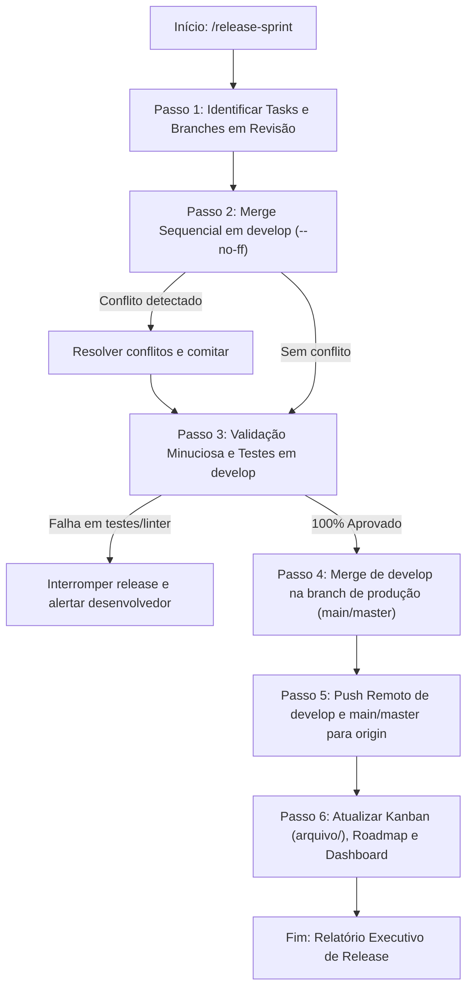

# Release Sprint Skill (Agnóstica, Homologação & Entrega GitFlow)

Esta skill orquestra a **entrega, validação rigorosa e release para produção** das funcionalidades desenvolvidas durante uma sprint no ecossistema `planner/` e GitFlow em **qualquer repositório**.

---

## Princípios de Operação
- **Rastreabilidade GitFlow**: As branches locais desenvolvidas em worktrees são integradas sequencialmente em `develop` com merge commits semânticos (`--no-ff`).
- **Portão de Qualidade Rigoroso**: Nenhum merge em produção é permitido sem 100% de aprovação na suíte de testes, cobertura mínima e verificação estática de tipos e linters.
- **Sincronização Total do Ecossistema**: Promove as tarefas no Kanban (`revisao/` ➔ `arquivo/`), fecha o ciclo do roadmap e atualiza o dashboard interativo.
- **Segurança de Push Remoto**: Confirma conectividade e publica `develop` e `main`/`master` de forma atômica.

---

## Fluxo de Execução Passo a Passo



---

## Passo 0: Resolução da Raiz e Detecção de Branches

1. **Raiz do Projeto**:
   - Determine a raiz do repositório através de `git rev-parse --show-toplevel`.
2. **Identificação das Branches Padrão**:
   - **Branch de Integração**: detecte se existe `develop` (padrão) ou utilize branch staging configurada. Se não existir localmente mas existir no remoto, faça checkout: `git checkout -b develop origin/develop`.
   - **Branch de Produção**: detecte se a branch principal é `main` ou `master` (`git symbolic-ref refs/remotes/origin/HEAD` ou inspecione `git branch -a`).
3. **Detecção do Ambiente de Testes & Linter**:
   - Python: `.venv\Scripts\pytest.exe` (ou `pytest`), `ruff check`, `mypy`.
   - Node: `npm test` / `pnpm test` / `bun test`, `eslint`, `tsc`.
   - Go: `go test ./...`, `golangci-lint`.
   - Rust: `cargo test`, `cargo clippy`.

---

## Passo 1: Obtenção das Tasks e Branches em Revisão

1. **Varredura de Tarefas em Revisão**:
   - Inspecione a pasta `planner/backlog/revisao/`.
   - Para cada arquivo `<ID>-*.md`:
     - Extraia o metadado `branch:` e `commit:` do frontmatter.
     - Confirme que a branch existe localmente no Git (`git rev-parse --verify <branch>`).
2. **Validação do Roadmap**:
   - Inspecione `planner/roadmaps/` para localizar o roadmap ativo associado às tasks da sprint.
3. Se nenhuma task estiver em `revisao/` e o usuário não informou branches explicitamente:
   - Emita aviso: *"Não foram encontradas tarefas com status 'revisao' em planner/backlog/revisao/. Certifique-se de que a sprint foi executada via /backlog-sprint antes de rodar o release."*

---

## Passo 2: Merge Sequencial das Features em `develop`

1. **Checkout Limpo**:
   - Garanta que a working tree esteja limpa: `git status`.
   - Troque para a branch de integração: `git checkout develop`.
   - Sincronize com o remoto se aplicável: `git pull origin develop`.
2. **Merge Ordenado por Dependência**:
   - Para cada branch da sprint (ordenadas do core/infraestrutura para endpoints e testes):
     ```bash
     git merge <branch-da-task> --no-ff -m "Merge branch '<branch-da-task>' into develop"
     ```
3. **Resolução de Conflitos**:
   - Se ocorrer conflito durante o merge:
     - Identifique os arquivos conflitantes via `git status`.
     - Resolva preservando ambas as regras de negócio ou aplicando a evolução mais recente.
     - Execute o linter e finalize o commit de merge:
       ```bash
       git add .
       git commit -m "Merge branch '<branch-da-task>' into develop (resolvidos conflitos)"
       ```

---

## Passo 3: Validação Minuciosa e Bateria de Testes em `develop`

Na branch `develop`, execute obrigatoriamente:

1. **Suíte Completa de Testes Automatizados**:
   - Execute o test runner com flag de medição de cobertura de código:
     - Python: `pytest --cov=<pacote> --cov-report=term-missing`
     - Node: `npm test -- --coverage`
   - **Critério**: 100% dos testes devem passar (0 falhas) e a cobertura deve atender a meta do projeto (ex.: $\ge 95\%$).
2. **Análise Estática, Linters e Formatação**:
   - Execute o linter estrito do projeto (ex.: `ruff check src/ tests/`, `eslint`).
   - Verifique a formatação (ex.: `ruff format --check src/ tests/`, `prettier --check`). Se houver arquivos desformatados, formate (`ruff format`) e comite o ajuste de estilo em `develop`:
     ```bash
     git add .
     git commit -m "style: formatacao de codigo na esteira de release"
     ```
3. **Checagem de Tipos Estrita**:
   - Execute o validador de tipagem (ex.: `mypy <src>`, `tsc --noEmit`).
   - **Critério**: 0 erros de tipagem estrita.
4. **Dry-Runs & Evals (quando aplicável)**:
   - Execute testes de avaliação ou smoke tests simulados (ex.: `python -m tests.evals.run_evals --dry-run`).

> [!CAUTION]
> Se qualquer teste ou verificação estática falhar, **ABORTAR o processo de promoção para produção**. Reporte o erro detalhado ao desenvolvedor para correção em `develop`.

---

## Passo 4: Merge em Produção (`main` ou `master`)

Com `develop` 100% testado e aprovado:

1. **Checkout da Branch de Produção**:
   - `git checkout main` (ou `master`).
   - Sincronize com o remoto: `git pull origin main`.
2. **Merge de Release (--no-ff)**:
   - Crie o commit semântico consolidando a release da sprint:
     ```bash
     git merge develop --no-ff -m "merge: release <slug-da-sprint> (<lista-de-tasks>)"
     ```
     *(Exemplo: `git merge develop --no-ff -m "merge: release sprint-2026-09-16 (FEAT-13, TECH-06, FEAT-09, TECH-07, TECH-08)"`)*

---

## Passo 5: Push Remoto Seguro

1. Publique as branches atualizadas para o repositório remoto:
   ```bash
   git push origin develop
   git push origin main  # ou master
   ```
2. *(Opcional)* Se as feature branches locais também precisarem de backup remoto para auditoria:
   ```bash
   git push -u origin <branch-1> <branch-2> ...
   ```

---

## Passo 6: Transição Kanban, Roadmaps e Dashboard

1. **Atualização do Backlog (`planner/backlog/`)**:
   - Para cada task da release:
     - Mova o arquivo de `planner/backlog/revisao/<ID>-*.md` para `planner/backlog/arquivo/<ID>-*.md`.
     - Atualize o frontmatter: `status: concluido`.
   - Atualize `planner/backlog/README.md`:
     - Limpe a seção `### 👀 Em Revisão`.
     - Adicione os itens em `### 📦 Arquivo (Concluídas)` com suas respectivas datas e badges ✅.
     - Atualize a Matriz Esforço × Impacto marcando as tarefas com ✅.
2. **Atualização do Roadmap (`planner/roadmaps/`)**:
   - No roadmap da sprint (`planner/roadmaps/<slug>/README.md`):
     - Atualize frontmatter: `status: concluido`.
     - Marque todas as tasks da tabela como `✅ implementado`.
   - No índice `planner/roadmaps/README.md`:
     - Mova o roadmap da seção `## Ativos` para `## Concluídos`.
3. **Recompilação do Dashboard**:
   - Recompile `planner/dashboard.html` (via `python planner/build_dashboard.py` ou rotina equivalente) garantindo que as estatísticas do painel reflitam as novas tarefas concluídas.

---

## Passo 7: Relatório de Conclusão da Release

Apresente um sumário executivo em markdown no chat contendo:
- Versão/Sprint entregue.
- Tabela com todas as branches mescladas e hashes dos commits em `develop` e `main`.
- Resultados da validação (contagem de testes, cobertura alcançada, status dos linters).
- Status do push remoto para `origin/develop` e `origin/main`.
- Confirmação da transição do Kanban e atualização do dashboard.
