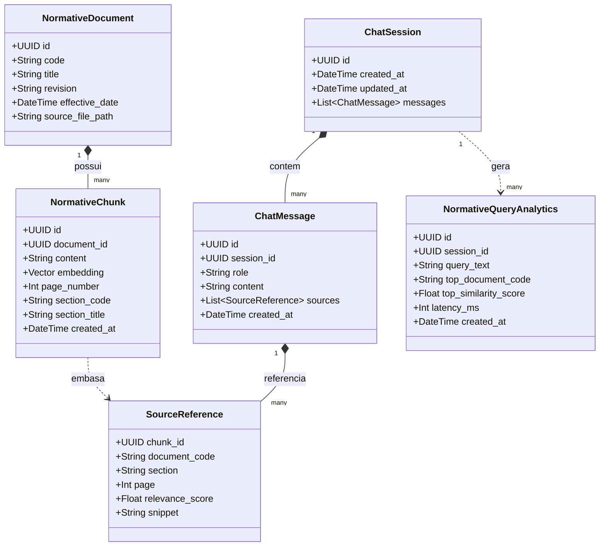

# 03. Modelagem do Projeto — Lumi
## 1. Visao Geral do Dominio
O dominio da **Lumi** gravita em torno do ciclo de vida de **Gestao do Conhecimento Normativo** e **Interacoes Conversacionais com RAG**.
Seguindo os preceitos de Domain-Driven Design (DDD), dividimos o modelo em dois contextos delimitados (Bounded Contexts):
1. **Contexto de Ingestao Normativa (Normative Ingestion Context):** Lida com documentos brutos, quebra semantica em fragmentos (chunks), metadados normativos e representacoes vetoriais (embeddings).
2. **Contexto de Conversacao e Sessao (Conversation & Session Context):** Gerencia as sessoes de chat do projetista, o historico de mensagens trocadas, as consultas executadas e as fontes citadas.
---
## 2. Entidades e Objetos de Valor (Domain Model)
### Contexto de Ingestao Normativa
- **NormativeDocument (Entidade):** Representa a norma tecnica oficial da Neoenergia (ex.: DIS-NOR-030, Revisao REV07).
- **NormativeChunk (Entidade / Vetor):** Fragmento textual com sentido semantico completo (ex.: secao de calculo de demanda, tabela de fatores de simultaneidade).
- **ChunkMetadata (Value Object):** Codigo da norma, numero da pagina, secao/capitulo, titulo do trecho e hashes de integridade.
- **EmbeddingVector (Value Object):** Vetor float de dimensao compativel com o modelo de embedding utilizado (ex.: 768 ou 1536 dimensoes) armazenado no pgvector.
### Contexto de Conversacao & Analytics
- **ChatSession (Entidade):** Agregado raiz da conversa. Identificado por session_id, vinculando um projetista a sua jornada de duvidas.
- **ChatMessage (Entidade):** Mensagem individual contendo papel (user, assistant ou system), conteudo e timestamp de criacao.
- **SourceReference (Value Object):** Registro dos fragmentos normativos utilizados para embasar uma mensagem do assistente, contendo norma, pagina, trecho textual e score de relevancia.
- **NormativeQueryAnalytics (Entidade / Registro):** Telemetria analitica anonimizada registrando tempo de resposta, tokens gerados, norma consultada e score de similaridade para auditoria academica e da concessionaria.
---
## 3. Diagrama de Classes e Entidades (Mermaid)

---
## 4. Dicionario de Dados do Banco Relacional / Vetorial (PostgreSQL + pgvector)
### Tabela: normative_documents
Armazena o catalogo das normas processadas pelo sistema.
| Coluna | Tipo | Restricoes | Descricao |
| :--- | :--- | :--- | :--- |
| id | UUID | PRIMARY KEY, DEFAULT gen_random_uuid() | Identificador unico do documento |
| code | VARCHAR(50) | NOT NULL, UNIQUE | Codigo da norma (ex.: DIS-NOR-030) |
| title | VARCHAR(255) | NOT NULL | Titulo oficial da norma |
| revision | VARCHAR(20) | NOT NULL | Codigo da revisao (ex.: REV07) |
| created_at | TIMESTAMP WITH TIME ZONE | DEFAULT NOW() | Data de ingestao no sistema |
### Tabela: normative_chunks
Armazena os fragmentos de texto indexados para busca vetorial.
| Coluna | Tipo | Restricoes | Descricao |
| :--- | :--- | :--- | :--- |
| id | UUID | PRIMARY KEY, DEFAULT gen_random_uuid() | Identificador unico do fragmento |
| document_id | UUID | REFERENCES normative_documents(id) ON DELETE CASCADE | Vinculo com a norma pai |
| content | TEXT | NOT NULL | Conteudo textual do fragmento |
| embedding | vector(EMBEDDING_DIMENSION) | NOT NULL | Vetor denso indexado com HNSW. Dimensao configuravel via variavel de ambiente (ex.: 768 para Google Gemini ou 1536 para OpenAI). Trocar a dimensao exige re-ingestao completa e rebuild do indice HNSW. |
| section_code | VARCHAR(50) | NULL | Secao correspondente (ex.: 5.2.1) |
| section_title | VARCHAR(255) | NULL | Titulo da secao ou tabela |
| page_number | INTEGER | NULL | Pagina do PDF de origem |
| metadata | JSONB | DEFAULT '{}' | Metadados adicionais e tags |
### Tabela: chat_sessions
Registra sessoes de atendimento mantidas pelo frontend do Wizard NeoGuide.
| Coluna | Tipo | Restricoes | Descricao |
| :--- | :--- | :--- | :--- |
| id | UUID | PRIMARY KEY | Identificador da sessao (gerado pelo cliente ou servidor) |
| created_at | TIMESTAMP WITH TIME ZONE | DEFAULT NOW() | Inicio da conversa |
| updated_at | TIMESTAMP WITH TIME ZONE | DEFAULT NOW() | Ultima interacao registrada |
### Tabela: chat_messages
Historico de mensagens de cada sessao para manter o contexto multi-turn.
| Coluna | Tipo | Restricoes | Descricao |
| :--- | :--- | :--- | :--- |
| id | UUID | PRIMARY KEY, DEFAULT gen_random_uuid() | Identificador da mensagem |
| session_id | UUID | REFERENCES chat_sessions(id) ON DELETE CASCADE | Sessao a qual a mensagem pertence |
| role | VARCHAR(20) | NOT NULL | Papel do emissor: user, assistant ou system |
| content | TEXT | NOT NULL | Conteudo da mensagem |
| sources | JSONB | DEFAULT '[]' | Metadados das fontes citadas (no caso do assistente) |
| created_at | TIMESTAMP WITH TIME ZONE | DEFAULT NOW() | Timestamp de envio |
### Tabela: normative_query_analytics
Registros consolidados de uso para analise de recorrencia e metricas do projeto.
| Coluna | Tipo | Restricoes | Descricao |
| :--- | :--- | :--- | :--- |
| id | UUID | PRIMARY KEY, DEFAULT gen_random_uuid() | Identificador unico da telemetria |
| session_id | UUID | REFERENCES chat_sessions(id) ON DELETE SET NULL | Sessao que originou a consulta |
| query_text | TEXT | NOT NULL | Pergunta formulada pelo projetista |
| top_document_code | VARCHAR(50) | NULL | Norma mais relevante recuperada |
| top_similarity_score | FLOAT | NULL | Maior pontuacao de similaridade de cosseno |
| latency_ms | INTEGER | NOT NULL | Tempo total do ciclo RAG em milissegundos |
| created_at | TIMESTAMP WITH TIME ZONE | DEFAULT NOW() | Timestamp da consulta |
---
## 5. Estrategia de Indices & Otimizacao de Performance
Para garantir tempo de resposta na casa de milissegundos mesmo com crescimento continuo do historico:
### 1. Indice Composto B-Tree para Recuperacao de Historico
```sql
CREATE INDEX idx_chat_messages_session_time 
ON chat_messages(session_id, created_at DESC);
```
- **Proposito:** Permite buscar instantaneamente as ultimas N mensagens de uma conversa com complexidade O(log N), viabilizando a injecao de contexto no prompt do LangChain sem custo perceptivel de I/O.
### 2. Indice HNSW (Hierarchical Navigable Small World) para Busca Vetorial
```sql
CREATE INDEX idx_normative_chunks_hnsw 
ON normative_chunks USING hnsw (embedding vector_cosine_ops)
WITH (m = 16, ef_construction = 64);
```
- **Proposito:** O algoritmo HNSW constroi um grafo multi-camada que fornece taxa de recall superior a 99% com latencias de consulta tipicamente inferiores a 20ms, dispensando recalculo de listas (diferente do IVFFlat).
### 3. Indice de Agrupamento Temporal para Analytics
```sql
CREATE INDEX idx_analytics_created 
ON normative_query_analytics(created_at DESC);
```
- **Proposito:** Otimiza consultas de agregacao para dashboards e relatorios de duvidas mais frequentes.

### 4. Indice de Chave Estrangeira para Fragmentos por Documento
```sql
CREATE INDEX idx_normative_chunks_document_id 
ON normative_chunks(document_id);
```
- **Proposito:** Evita varreduras sequenciais (seq scans) na tabela de chunks ao consultar ou atualizar todos os fragmentos de uma norma especifica, cenario recorrente na re-ingestao de revisoes atualizadas.
