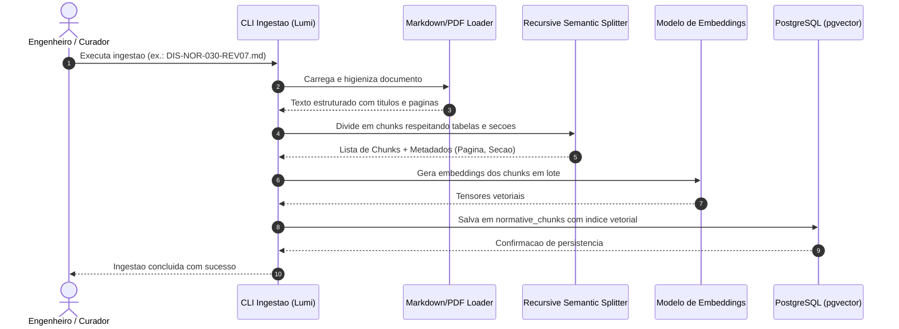
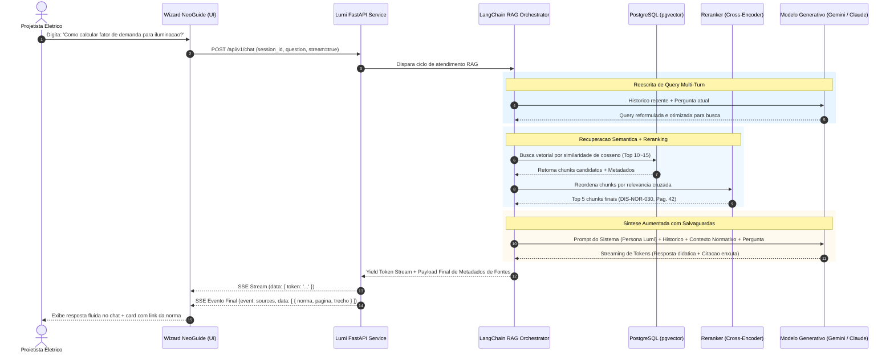
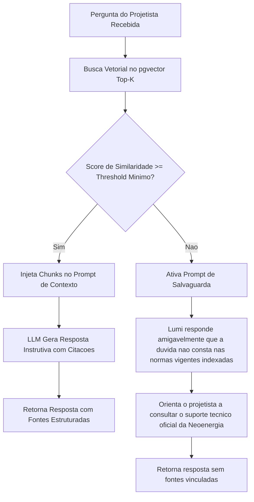
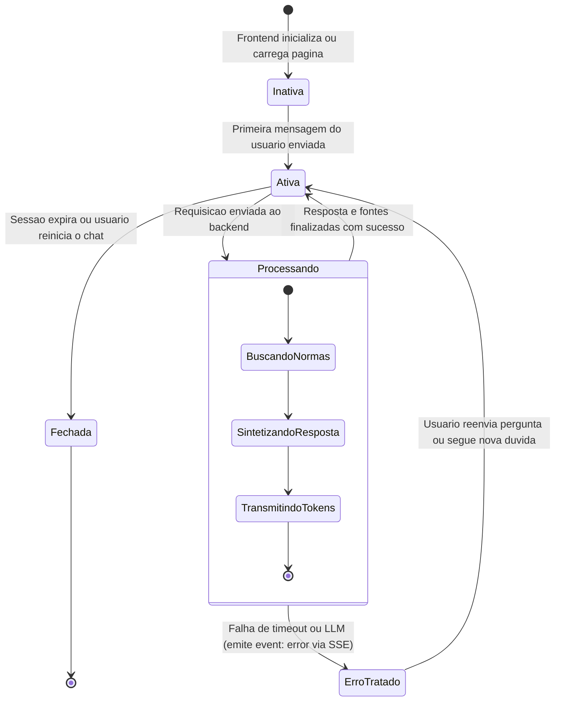

# 04. Fluxos do Projeto -- Lumi

## 1. Fluxo de Ingestao e Processamento Normativo (Offline / Batch)

Este fluxo e executado periodicamente pela equipe tecnica ou via comando de CLI sempre que uma nova norma for homologada ou sofrer revisao pela concessionaria.

---

## 2. Fluxo Conversacional de Pergunta e Resposta (RAG em Tempo Real)

Este e o fluxo principal de atendimento ao projetista eletrico navegando no Wizard NeoGuide.

---

## 3. Fluxo de Tratamento para Perguntas Fora de Escopo / Sem Evidencia

Salvaguarda essencial para evitar que a Lumi alucine regras que possam causar a reprovacao do projeto na Neoenergia.

---

## 4. Diagrama de Estados da Sessao Conversacional

> **Protocolo de Erro em Streaming SSE:** Caso a LLM desconecte ou falhe durante a transmissao de tokens, a API emite imediatamente um evento `event: error` com mensagem amigavel padronizada e encerra o stream. Nao ha retry no meio de uma resposta parcial para manter a coerencia do texto ja exibido ao projetista.

