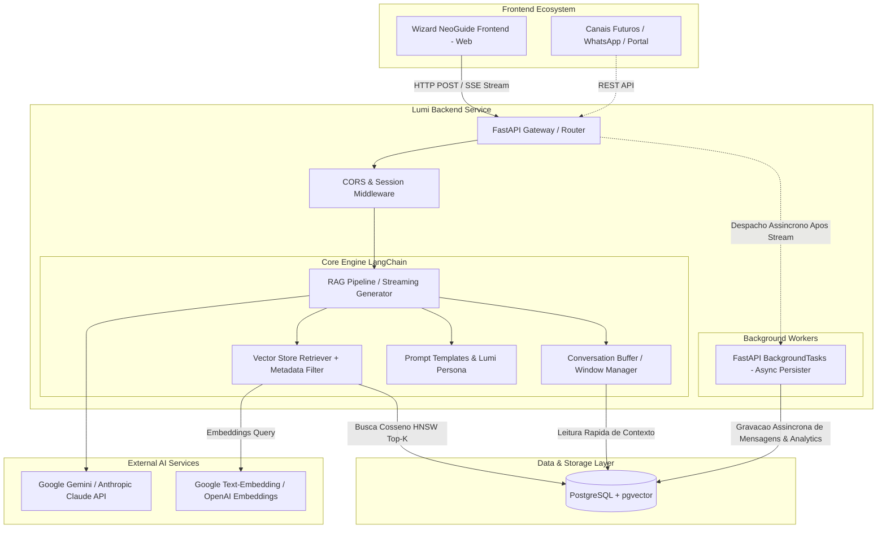

# 05. Arquitetura do Projeto — Lumi

## 1. Visao Arquitetural de Alto Nivel

A **Lumi** adota uma arquitetura de servicos **Headless & Microservice-oriented**, desacoplada da interface do usuario.
Seu papel no ecossistema **NeoGuide** e fornecer inteligencia normativa sob demanda via endpoints HTTP RESTful e eventos em tempo real (Server-Sent Events).

---

## 2. Stack Tecnologica e Racional de Escolhas

| Camada | Tecnologia Escolhida | Justificativa Tecnica |
| :--- | :--- | :--- |
| **Containerizacao & Ambiente** | **Docker & Docker Compose** | Isolamento total: a aplicacao Lumi e o PostgreSQL com pgvector rodam em containers desacoplados, dispensando instalacao manual de dependencias no host. |
| **Linguagem & Runtime** | **Python 3.12+ (no container)** | Ecossistema de IA e RAG rodando encapsulado dentro do container da API. |
| **Gerenciador de Pacotes** | **uv (Astral)** | Gerenciador moderno em Rust extremamente rapido, deterministico com uv.lock e suporte nativo a ambientes virtuais. |
| **Migracoes de Banco** | **Alembic** | Gerenciamento versionado de migracoes DDL integrado ao SQLAlchemy assincrono, garantindo evolucao controlada do schema com rastreabilidade completa. |
| **Framework Web** | **FastAPI** | Alta performance assincrona (asyncio), geracao nativa de OpenAPI (Swagger) e suporte robusto a streaming via StreamingResponse e BackgroundTasks. |
| **Logging Estruturado** | **structlog (JSON)** | Logs estruturados em formato JSON para correlacao de requests, debug do pipeline RAG e complemento a tabela normative_query_analytics. |
| **Orquestracao de RAG** | **LangChain** | Padrao da industria para cadeias de RAG, gerenciamento flexivel de historico de chat e troca agnostica de provedores de LLM. |
| **Banco Vetorial & Relacional** | **PostgreSQL + pgvector** | Solucao unificada e gratuita: gerencia entidades relacionais (sessoes, mensagens, analytics) e vetores densos com indices HNSW sem custo de bancos dedicados. |
| **Modelos de Linguagem (LLMs)**| **Google Gemini (primario) / Anthropic Claude (alternativo)** | Google Gemini como provedor primario por custo reduzido e grande janela de contexto. Anthropic Claude disponivel como alternativa manual via troca de variavel de ambiente, sem fallback automatico entre provedores. |
| **Middleware CORS** | **Permissivo (`*`)** | Todas as origens sao aceitas no MVP academico. O frontend do Wizard NeoGuide consome a API diretamente do browser; restricao de dominios sera aplicada em producao. |

---

## 3. Contratos de API (Endpoints & Payloads)

### 3.1. Enviar Mensagem / Consulta Normativa
- **Endpoint:** POST /api/v1/chat
- **Headers:** Content-Type: application/json

#### Payload de Requisicao (Request Body):
`json
{
  "session_id": "9b1deb4d-3b7d-4bad-9bdd-2b0d7b3dcb6d",
  "message": "Qual e a demanda minima para um condominio residencial com 12 apartamentos?",
  "stream": true
}
`

#### Payload de Resposta (Quando stream: false):
`json
{
  "session_id": "9b1deb4d-3b7d-4bad-9bdd-2b0d7b3dcb6d",
  "response": "Ola! Para um condominio residencial com 12 apartamentos, o calculo de demanda deve considerar a aplicacao do fator de diversidade previsto na tabela correspondente da norma tecnica da Neoenergia...",
  "sources": [
    {
      "document_code": "DIS-NOR-030",
      "revision": "REV07",
      "section": "Item 5.3 — Dimensionamento de Edificacoes de Uso Coletivo",
      "page": 28,
      "relevance_score": 0.89,
      "snippet": "Para edificios residenciais com ate 24 unidades consumidoras, aplicar a Tabela 4..."
    }
  ],
  "created_at": "2026-09-09T21:00:00Z"
}
`

#### Transmissao Streaming (stream: true via SSE):
`	ext
event: token
data: {"token": "Ola! "}

event: token
data: {"token": "Para um condominio "}

...

event: sources
data: [{"document_code": "DIS-NOR-030", "page": 28, "section": "Item 5.3", "relevance_score": 0.89}]

event: done
data: {"session_id": "9b1deb4d-3b7d-4bad-9bdd-2b0d7b3dcb6d"}

event: error
data: {"error": "Desculpe, ocorreu uma falha temporaria na geracao da resposta. Por favor, tente novamente.", "code": "LLM_STREAM_ERROR"}
`

### 3.2. Health Check
- **Endpoint:** GET /api/v1/health
- **Descricao:** Verifica a disponibilidade da API e a conectividade com o PostgreSQL.

#### Payload de Resposta:
`json
{
  "status": "healthy",
  "database": "connected",
  "timestamp": "2026-09-09T21:00:00Z"
}
`

---

## 4. Registro de Decisoes Arquiteturais (ADRs)

### ADR-01: Adocao do PostgreSQL com pgvector para Dados e Vetores
- **Status:** Aprovado.
- **Contexto:** Precisamos de persistencia para sessoes de chat e um mecanismo vetorial performatico com custo zero de infraestrutura.
- **Decisao:** Utilizar PostgreSQL com a extensao pgvector.
- **Consequencias:** Elimina a necessidade de contratar ou manter bancos vetoriais dedicados proprietarios; simplifica backups ACID integrados; viabiliza deploys gratuitos em instancias locais Docker ou provedores em nuvem como Supabase/Neon.
- **Parametros de Pool (asyncpg):** `pool_size=5`, `max_overflow=10`, `pool_timeout=30` configuraveis via variaveis de ambiente para ajuste fino conforme carga.

### ADR-02: Gerenciamento com uv em vez de Poetry/Pipenv
- **Status:** Aprovado.
- **Contexto:** O time academico precisa de agilidade na instalacao de dependencias pesadas de IA sem conflitos de resolucao.
- **Decisao:** Padronizar o projeto com uv.
- **Consequencias:** Resolucao e instalacao de dependencias ate 10-100x mais rapida; trava de dependencias precisa com uv.lock.

### ADR-03: Separacao de Metadados de Fontes no Retorno da API
- **Status:** Aprovado.
- **Contexto:** Respostas com citacoes longas no meio do texto poluem a leitura do usuario no chat do Wizard NeoGuide.
- **Decisao:** Manter citacoes textuais enxutas no corpo da resposta e enviar o catalogo detalhado de fontes como metadados estruturados no payload HTTP/SSE.
- **Consequencias:** O frontend ganha liberdade total para desenhar cards expansiveis, modais com visualizacao da norma ou links diretos para a pagina do documento.

### ADR-04: Persistencia Desacoplada e Gravacao Assincrona de Historico (BackgroundTasks)
- **Status:** Aprovado.
- **Contexto:** Em sistemas com RAG, o gargalo perceptivel ao usuario e a latencia do modelo generativo. Operacoes sincronas de escrita no banco de dados a cada token ou mensagem adicionam bloqueios de I/O e degradam a fluidez do chat.
- **Decisao:** O fluxo de streaming SSE entrega imediatamente os tokens ao cliente. A persistencia das mensagens geradas e o registro de telemetria analitica sao despachados via FastAPI BackgroundTasks de forma totalmente assincrona em segundo plano.
- **Consequencias:** Latencia zero de escrita para o usuario final; preservacao integral de sessoes para historico e analytics; isolamento de falhas de persistencia sem interrupcao da resposta ao usuario.

### ADR-05: Containerizacao Total com Docker e Docker Compose (Zero-Setup Local)
- **Status:** Aprovado.
- **Contexto:** Os desenvolvedores do time possuem ambientes heterogeneos. A compilacao local da extensao pgvector no PostgreSQL e configuracoes de ambiente de IA costumam gerar atritos de setup.
- **Decisao:** O projeto sera executado integralmente via Docker e orquestrado por `docker-compose.yml`, contendo dois servicos:
  1. `lumi-db`: Imagem oficial `pgvector/pgvector:pg16` com persistencia de volume local;
  2. `lumi-api`: Container Python otimizado rodando FastAPI com hot-reload de desenvolvimento.
- **Consequencias:** Setup reproduzivel em um unico comando (`docker compose up --build`); zero necessidade de instalar Python, PostgreSQL ou dependencias na maquina do desenvolvedor; paridade total de ambiente entre todos os membros do grupo.
