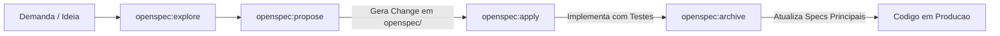

# 06. Estrutura de Pastas e Convencoes do Repositorio — Lumi

## 1. Visao Geral da Arvore de Diretorios

O projeto segue o padrao modular em camadas para projetos Python modernos, isolando as responsabilidades de ingestao de dados, camada de servico, orquestracao de IA e interfaces de API.

```text
lumi-neoguide/
├── .env.example               # Variaveis de ambiente de exemplo (chaves de API, DB URL)
├── .gitignore                 # Arquivos ignorados pelo Git
├── pyproject.toml             # Configuracao do projeto e dependencias gerenciadas pelo uv
├── uv.lock                    # Trava de dependencias deterministica do uv
├── README.md                  # Apresentacao do projeto e instrucoes de execucao
├── docker-compose.yml         # Orquestra os servicos locais: lumi-api e lumi-db (pgvector)
├── .pre-commit-config.yaml    # Automacao de hooks git (qualidade, tipagem e seguranca)
├── openspec/                  # Especificacoes formais e historico de mudancas (SDD)
│   ├── project.md             # Visao e diretrizes gerais do OpenSpec
│   ├── specs/                 # Especificacoes estaveis dos modulos
│   └── changes/               # Propostas, deltas e tarefas de implementacao
├── graphify-out/              # Grafo de conhecimento persistente do codebase (Graphify)
│
├── docs/                      # Documentacao tecnica de engenharia
│   ├── 01-VISAO.md
│   ├── 02-REQUISITOS.md
│   ├── 03-MODELAGEM.md
│   ├── 04-FLUXOS.md
│   ├── 05-ARQUITETURA.md
│   ├── 06-ESTRUTURA-DE-PASTAS.md
│   ├── 07-SEGURANCA-E-AVALIACAO-IA.md
│   └── info/                  # Materiais normativos brutos (DIS-NOR-030, DIS-NOR-053)
│
├── planner/                   # Gestao agil de tarefas e backlog (Kanban + Roadmaps)
│   ├── anexos/
│   ├── roadmaps/
│   └── backlog/
│
├── src/                       # Codigo-fonte principal da aplicacao
│   └── lumi/
│       ├── __init__.py
│       ├── main.py            # Ponto de entrada FastAPI (inicializacao da aplicacao)
│       │
│       ├── api/               # Camada de Interface HTTP & Rotas
│       │   ├── __init__.py
│       │   ├── deps.py        # Injecao de dependencias (banco, servicos)
│       │   └── v1/
│       │       ├── __init__.py
│       │       ├── router.py  # Agregador de rotas v1
│       │       ├── chat.py    # Endpoints de conversacao (/chat, streaming SSE)
│       │       └── health.py  # Health check do servico e conexoes
│       │
│       ├── core/              # Configuracoes centrais do sistema
│       │   ├── __init__.py
│       │   ├── config.py      # Pydantic Settings (leitura de .env)
│       │   └── logging.py     # Configuracao de logs estruturados
│       │
│       ├── db/                # Persistencia de Dados & Conexao PostgreSQL
│       │   ├── __init__.py
│       │   ├── session.py     # Engine assincrono SQLAlchemy / Conexao
│       │   ├── models.py      # Modelos ORM (sessions, messages, documents)
│       │   └── vector_store.py# Gerenciador da tabela e indices pgvector
│       │
│       ├── schemas/           # Schemas de validacao e DTOs (Pydantic)
│       │   ├── __init__.py
│       │   ├── chat.py        # ChatRequest, ChatResponse, SourceMetadata
│       │   └── session.py     # SessionCreate, SessionDetails
│       │
│       ├── services/          # Regras de Negocio e Servicos
│       │   ├── __init__.py
│       │   ├── chat_service.py    # Orquestracao da conversa e gravacao de historico
│       │   └── session_service.py # Ciclo de vida da sessao
│       │
│       ├── rag/               # Nucleo de Inteligencia Artificial & RAG (LangChain)
│       │   ├── __init__.py
│       │   ├── chains.py      # Construcao da cadeia RAG (Retrieval + Generation)
│       │   ├── prompts.py     # System prompts e persona amigavel da Lumi
│       │   ├── retriever.py   # Estrategia de busca e filtro de similaridade
│       │   └── llm_factory.py # Instanciacao dinamica de LLMs (Gemini / Claude)
│       │
│       └── ingestion/         # Pipeline de Processamento Normativo (CLI & Scripts)
│           ├── __init__.py
│           ├── parser.py      # Leitura e extracao de Markdown/PDF das normas
│           ├── chunker.py     # Divisao de texto orientada a tabelas e secoes
│           └── pipeline.py    # Script executavel de ingestao de normas
│
├── tests/                     # Testes automatizados (pytest)
│   ├── conftest.py            # Fixtures e configuracoes de teste
│   ├── unit/                  # Testes unitarios isolados
│   │   ├── test_prompts.py
│   │   └── test_chunker.py
│   ├── integration/           # Testes de integracao de API e banco
│   │   ├── test_api_chat.py
│   │   └── test_vector_search.py
│   └── evals/                 # Testes de avaliacao de IA e fidelidade RAG
│       ├── golden_dataset.json
│       └── test_rag_evals.py
│
└── docker/                    # Arquivos de containerizacao da aplicacao
    ├── Dockerfile             # Multi-stage build Python + uv com hot-reload
    └── init.sql               # Script de inicializacao automatica (CREATE EXTENSION vector)
│
├── alembic/                   # Migracoes versionadas de banco de dados (Alembic)
│   ├── env.py                 # Configuracao do Alembic com SQLAlchemy async
│   └── versions/              # Scripts de migracao sequenciais
```

---

## 2. Responsabilidade das Camadas

- **src/lumi/api/**: Responsavel estritamente pela traducao do protocolo HTTP/SSE para os casos de uso do sistema. Nao contem logica de negocio nem regras de prompt.
- **src/lumi/schemas/**: Define contratos estritos de entrada e saida (DTOs) com validacao automatica de dados via Pydantic v2.
- **src/lumi/rag/**: Contem a inteligencia do agente. Isola a logica do LangChain e a fabrica de modelos, permitindo trocar o provedor de IA sem tocar nas rotas da API.
- **src/lumi/ingestion/**: Responsavel pelo pre-processamento das normas. Pode ser executado em batch ou via script sem precisar subir a API web.
- **src/lumi/db/**: Gerencia o pool de conexoes do PostgreSQL e o armazenamento vetorial com pgvector.

---

## 3. Convencoes de Codigo e Boas Praticas

1. **Nomenclatura:**
   - Modulos e pacotes: snake_case (ex.: chat_service.py).
   - Classes e Modelos: PascalCase (ex.: ChatResponse, NormativeChunk).
   - Constantes e variaveis de ambiente: UPPER_CASE (ex.: GEMINI_API_KEY).
2. **Tipagem Estrita (Type Hints):** Todas as funcoes e metodos devem declarar tipos de argumentos e retornos explicitamente.
3. **Assincronismo:** Endpoints de API e chamadas de I/O (banco e rede) devem ser implementados utilizando funcoes assincronas.
4. **Variaveis de Ambiente:** Nenhuma chave de API ou credencial deve constar no codigo. Toda configuracao sensivel deve residir em arquivo .env gerenciado pelo Pydantic Settings.

---

## 4. Execucao com Zero-Setup Local (Docker & Docker Compose)

Toda a solucao roda sem necessidade de instalar dependencias ou o PostgreSQL na maquina do desenvolvedor:

```b`ash
# 1. Clonar o repositorio e configurar variaveis de ambiente
cp .env.example .env

# 2. Subir todos os servicos (Lumi API + PostgreSQL pgvector)
docker compose up --build

# 3. Acessar a documentacao interativa da API
# URL: http://localhost:8000/docs
```

---

## 5. Qualidade, Seguranca e Git Hooks (pre-commit)

Para assegurar que nenhum commit entre no repositorio com quebra de padroes, erros de tipagem estatica ou vazamento acidental de chaves de API, o projeto estabelece uma esteira de **pre-commit hooks**.

### 5.1. Pilares Inspecionados pelos Hooks

| Pilar | Ferramenta | O que valida antes de permitir o commit? |
| :--- | :--- | :--- |
| **Seguranca & Anti-Leak** | **detect-secrets / detect-private-key** | Impede o commit acidental de chaves de API (AIzaSy..., sk-ant-...), certificados e tokens privados. |
| **Qualidade & Formatacao** | **Ruff (Linter & Formatter)** | Inspeciona e formata o codigo Python em milissegundos (regras PEP 8, remocao de imports nao usados e ordenacao). |
| **Checagem de Tipos** | **Mypy** | Garante que todas as assinaturas de funcoes e modelos possuam tipagem estatica valida. |
| **Sintaxe de Configuracao** | **check-yaml / check-toml / check-json** | Valida a sintaxe de arquivos de configuracao (pyproject.toml, Docker Compose, etc.). |
| **Higiene de Arquivos** | **end-of-file-fixer / trailing-whitespace** | Remove espacos sobressalentes e padroniza quebras de linha. |

### 5.2. Como Ativar os Hooks no Ambiente Local

Para desenvolvedores que forem realizar commits diretamente na maquina local:

```bash
# 1. Instalar os hooks no diretorio .git local
uv run pre-commit install

# 2. Executar manualmente a esteira sobre todos os arquivos (opcional)
uv run pre-commit run --all-files
```

---

## 6. Metodologia de Engenharia: OpenSpec (SDD) e Graphify

Para alcancar alto rigor de engenharia e rastreabilidade, o projeto adota duas abordagens complementares de suporte ao desenvolvimento:

### 6.1. Desenvolvimento Orientado a Especificacoes (OpenSpec / SDD)
Toda funcionalidade relevante ou refatoracao segue o fluxo estrito de **Spec-Driven Development (SDD)** antes da codificacao:



1. **explore**: Investigacao do problema e refinamento de requisitos.
2. **propose**: Geracao formal de artefatos da mudanca (proposal.md, deltas de especificacao e tasks.md).
3. **apply**: Implementacao orientada a tarefas com garantia de testes automatizados e criterios de aceite.
4. **archive**: Homologacao, sincronizacao com as especificacoes principais e arquivamento do historico.

### 6.2. Analise de Impacto Arquitetural e Dependencias (Graphify)
O **Graphify** mantem um grafo de conhecimento da base de codigo persistido em `graphify-out/`:
- **Mapeamento de Dependencias:** Modela arquivos, funcoes, rotas e tabelas como nos e arestas interconectadas.
- **Triage e Impacto de Mudancas:** Antes de realizar alteracoes no motor de chunking ou no contrato da API, o time consulta o grafo para identificar exatamente quais testes, componentes de RAG ou schemas serao impactados.
- **Deteccao de God Nodes:** Monitora o surgimento de modulos com acoplamento excessivo para direcionar refatoracoes preventivas.
