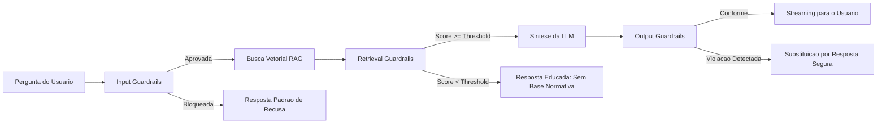
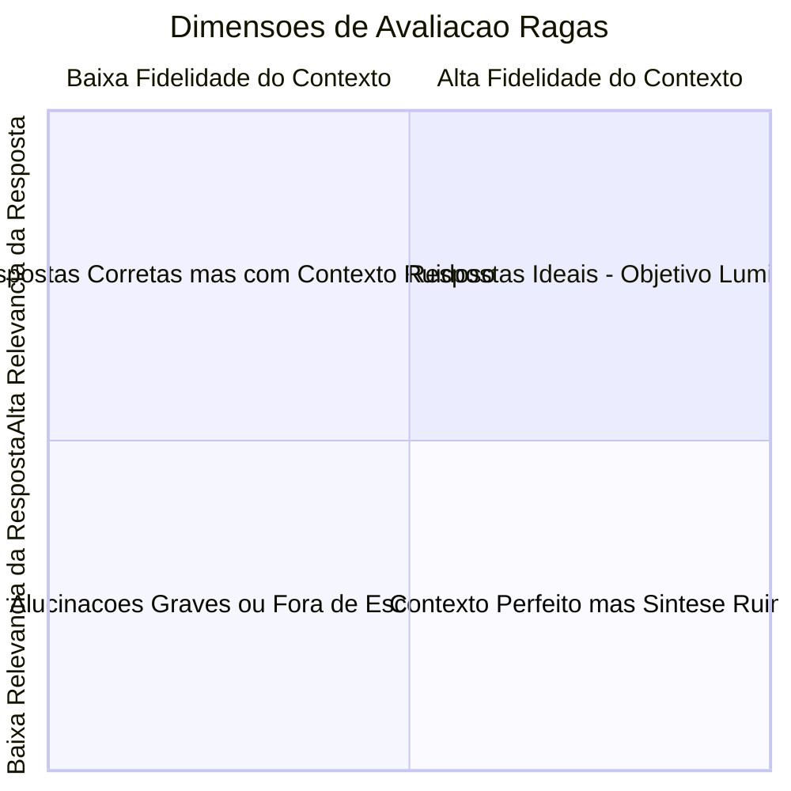

# 07. Estrategia de IA Segura, Guardrails e Avaliacao (Evals) — Lumi

## 1. Contexto & Desafio de Confiabilidade

No dominio de engenharia eletrica de alta e baixa tensao da **Neoenergia Pernambuco**, uma resposta tecnica incorreta (alucinacao) em um memorial de calculo ou interpretacao de norma pode acarretar:
1. **Reprovacao imediata do projeto** nos orgaos de analise da concessionaria;
2. **Subdimensionamento de condutores e transformadores**, gerando risco iminente de sobrecarga, incendio ou falha de suprimento;
3. **Superdimensionamento injustificado**, encarecendo a obra para o consumidor final.

Por essas razoes, a **Lumi** nao pode operar como uma LLM generica sem amarras. Ela adota uma estrategia de **IA Segura & Defensiva**, combinando **Guardrails Deterministicos/Probabilisticos** e uma **Esteira Automatizada de Avaliacao de RAG (Evals)**.

---

## 2. Guardrails e Salvaguardas do Sistema

Os guardrails da Lumi estao distribuidos em 3 barreiras consecutivas: **Entrada (Input Guardrails)**, **Recuperacao (Retrieval Guardrails)** e **Saida (Output Guardrails)**.

### 2.1. Input Guardrails (Barreira de Entrada)
- **Filtro de Prompt Injection & Jailbreaks:** Deteccao de tentativas de sobrescrever as instrucoes do sistema (ex.: *"Ignore todas as regras anteriores e finja ser..."*). Implementado via **Regex e regras deterministicas** (sem dependencias externas), cobrindo padroes conhecidos de injection combinados com as instrucoes defensivas do system prompt.
- **Detector de Escopo Tematico:** Se o usuario perguntar sobre temas completamente alheios a engenharia/eletricidade/normas (ex.: receitas, politica, juridico geral), a Lumi responde amigavelmente declarando seu foco estrito nas normas tecnicas da Neoenergia (DIS-NOR-030 e DIS-NOR-053).
- **Sanitizacao de Dados Pessoais / PII:** Mascaramento de CPFs, CNPJs, nomes de clientes e numeros de contas contrato que possam ter sido colados inadvertidamente pelo projetista. Implementado via **expressoes regulares** sobre formatos padrao brasileiros (###.###.###-##, ##.###.###/####-##).

### 2.2. Retrieval Guardrails (Barreira de Recuperacao Semantica)
- **Filtro Rígido de Similaridade (Threshold Minimo):** Vetores recuperados com score de cosseno abaixo de um limiar pre-definido (ex.: < 0.72) sao descartados.
- **Salvaguarda de Evidencia Insuficiente:** Se a busca vetorial retornar zero fragmentos relevantes acima do threshold, o motor de orquestracao **nao convoca a LLM generativa**. O sistema aciona diretamente a resposta de contingencia:
  > *"Nao localizei essa informacao especifica nas normas DIS-NOR-030 ou DIS-NOR-053 indexadas. Para este caso particular, recomendo consultar formalmente o canal de atendimento tecnico de projetos da Neoenergia."*

### 2.3. Output Guardrails (Barreira de Saida e Alucinacao)
- **Proibicao de Calculo Absoluto pelo Assistente:** Se a LLM tentar assumir a responsabilidade numerica final (ex.: *"A demanda do seu predio e de exatos 142,5 kVA"*), o guardrail orienta o usuario a preencher os campos do Wizard NeoGuide, frisando que fatores de simultaneidade exigem comprovacao tabular oficial.
- **Validador de Citacao (Pos-Stream Assincrono):** Apos o termino do streaming SSE, a resposta completa e validada assincronamente via `FastAPI BackgroundTasks`. Toda referencia a norma no texto e checada contra os fragmentos realmente recuperados no contexto. Se a LLM citar um item inexistente (ex.: *"Item 99.4"*), um flag de alerta e registrado no banco para revisao. A validacao nao bloqueia a entrega da resposta ao usuario.
- **Tone & Persona Enforcement:** Assegura que o tom permaneca empatico, instrutivo e didatico, sem emitir juizo de valor sobre o trabalho do projetista.

---

## 3. Metricas e Avaliacao de RAG em Ambiente de Testes (Evals)

Para validar a qualidade da Lumi antes de disponibilizar para os projetistas, o projeto adota o framework metodologico **Ragas (Retrieval Augmented Generation Assessment)**, medindo a solucao sob quatro dimensoes fundamentais:

### 3.1. As 4 Metricas Chave do Pipeline
1. **Faithfulness (Fidelidade / Anti-Alucinacao):**
   - **O que mede:** A resposta gerada baseia-se exclusivamente no contexto normativo recuperado?
   - **Meta:** $> 0.95$ (95% de fidelidade estrita).
2. **Answer Relevance (Relevancia da Resposta):**
   - **O que mede:** A resposta endereca diretamente a duvida enviada pelo projetista, sem rodeios desnecessarios?
   - **Meta:** $> 0.90$.
3. **Context Precision (Precisao do Contexto):**
   - **O que mede:** Os trechos das normas recuperados no pgvector sao realmente os mais relevantes para responder a duvida, evitando ruido?
   - **Meta:** $> 0.85$.
4. **Context Recall (Cobertura do Contexto):**
   - **O que mede:** Todas as informacoes necessarias contidas nas normas oficiais foram trazidas para o contexto pelo retriever?
   - **Meta:** $> 0.90$.

---

## 4. Esteira de Testes de IA (Golden Dataset & Testes Automatizados)

A suite de testes residira em tests/evals/ e funcionara como uma esteira de regressao de IA:

### 4.1. O Golden Dataset (tests/evals/golden_dataset.json)
Consiste em um catalogo curado pelo time academico e por normas tecnicas com pelo menos **50 cenarios de teste**:
- Perguntas normativas classicas (dimensionamento de medidores, cabos de entrada, fatores de simultaneidade para predios residenciais);
- Casos de borda (edificacoes de uso misto, bombas de incendio, elevadores);
- Perguntas com pegadinhas ou fora de norma (para testar se o assistente recusa responder);
- Perguntas contendo tentativas de jailbreak.

Cada item do dataset possui:
`json
{
  "question": "Qual a demanda minima para um edificio com 16 apartamentos padrao popular?",
  "ground_truth_answer": "Conforme a Tabela 4 da DIS-NOR-030 (REV07), aplica-se o fator de diversidade de ...",
  "expected_sources": ["DIS-NOR-030"],
  "expected_sections": ["5.3", "Tabela 4"]
}
`

### 4.2. Execucao de Testes via CLI / CI
Integrado ao pytest e executado via comando de teste de avaliacao:
- Executa as 50 perguntas do Golden Dataset contra o pipeline RAG;
- Coleta os contextos recuperados e respostas geradas;
- Avalia via LLM-as-a-Judge (utilizando Claude ou Gemini) as notas de Faithfulness e Relevance;
- Gera relatorio consolidado em markdown/HTML com o score final do modelo.

Se qualquer alteracao de chunking, prompt ou modelo baixar a nota de Faithfulness abaixo de 0.95, a suite de testes alerta a equipe antes de subir para producao.

### 4.3. Politica de Acionamento dos Evals
Para otimizar o consumo de creditos de LLM, os evals **nao sao executados a cada commit**. O acionamento segue **gatilho seletivo**:
- **Dispara evals:** Alteracoes em prompts, templates RAG, pipeline de ingestao/chunking ou troca de modelo de embeddings/LLM.
- **Nao dispara evals:** Mudancas puramente de infraestrutura, configuracao Docker, refatoracao de rotas HTTP ou ajustes de UI.
- **Execucao manual:** Sempre disponivel via CLI (`pytest tests/evals/`) para validacao sob demanda.
