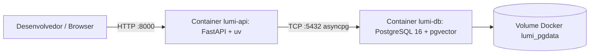

# Design: Containerização Local com Docker e pgvector

## Container Architecture
A arquitetura de containers isola o banco de dados vetorial da aplicação web:

### Decisões Técnicas
- **Dockerfile Multi-Stage**:
  - Imagem builder copia o binário estático oficial `ghcr.io/astral-sh/uv:latest` para `/bin/uv`.
  - Separação de cache: copia primeiro `pyproject.toml` e `uv.lock`, executa `uv sync --frozen --no-install-project`, e apenas depois copia o código fonte `src/`. Isso garante que edições no código não invalidem o cache de instalação de dependências.
  - Live reload: montagem do diretório `./src:/app/src` no Compose para recarregamento instantâneo.
- **pgvector Service**:
  - Imagem: `pgvector/pgvector:pg16`
  - Healthcheck nativo com `pg_isready` para garantir que o pool `asyncpg` da API não falhe na inicialização.
  - Script `init.sql` provisiona a extensão `vector`.
