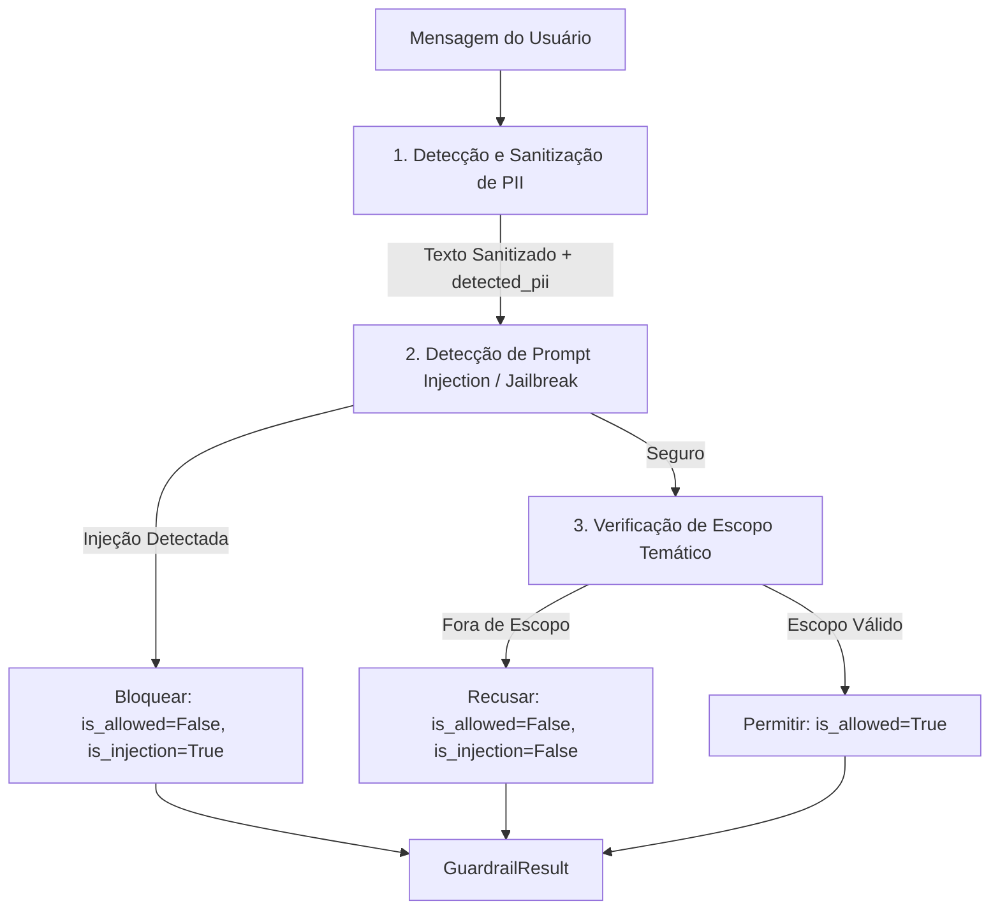

# Design: Guardrails de Entrada contra Prompt Injection e Sanitização de PII

## 1. Visão Geral da Arquitetura

Os Guardrails de Entrada constituem a primeira barreira do pipeline de IA Segura da Lumi (`src/lumi/rag/guardrails.py`). A premissa central é **garantia de execução determinística com latência sub-milissegundo (< 5ms)**, sem invocar chamadas de rede ou LLM-as-a-Judge durante a validação inicial da mensagem do usuário.



## 2. Estrutura de Dados: `GuardrailResult`

Definido como uma `dataclass` tipada:

```python
from dataclasses import dataclass, field


@dataclass(frozen=True)
class GuardrailResult:
    is_allowed: bool
    sanitized_text: str
    rejection_reason: str | None = None
    detected_pii: list[str] = field(default_factory=list)
    is_injection: bool = False
```

## 3. Especificação dos Componentes

### 3.1. Sanitização de PII Brasileiro (`sanitize_pii`)
As expressões regulares pré-compiladas cobrem padrões formatados e literais desformatados, respeitando delimitadores de palavras para evitar falsos positivos com números de portas ou códigos de equipamentos:

1. **CNPJ Formatado:** `\b\d{2}\.\d{3}\.\d{3}/\d{4}-\d{2}\b` -> `[CNPJ_REMOVIDO]`
2. **CPF Formatado:** `\b\d{3}\.\d{3}\.\d{3}-\d{2}\b` -> `[CPF_REMOVIDO]`
3. **CNPJ Desformatado (14 dígitos contínuos):** `\b\d{14}\b` -> `[CNPJ_REMOVIDO]`
4. **Conta Contrato / Faturamento:** `(?i)\b(?:conta[\s_-]*contrato|n[ºo°]?\s*(?:da\s*)?conta|documento\s*(?:de\s*)?faturamento|fatura\s*(?:n[ºo°])?)\s*[:#-]?\s*(\d{6,12})\b` -> substitui o grupo numérico por `[CONTA_CONTRATO_REMOVIDA]`
5. **CPF Desformatado (11 dígitos contínuos):** `\b\d{11}\b` -> `[CPF_REMOVIDO]`

A sanitização registra as categorias encontradas (`"CPF"`, `"CNPJ"`, `"CONTA_CONTRATO"`) em `detected_pii`.

### 3.2. Detecção de Prompt Injection & Jailbreak (`detect_prompt_injection`)
Varredura contra assinaturas de manipulação de comportamento e jailbreaks conhecidos, pré-compiladas com `re.IGNORECASE`. As strings são analisadas normalizando espaços e avaliando termos críticos em inglês e português:
- Instruções de esquecimento: `ignore (?:previous|all|the) instructions`, `ignore (?:todas as|as) instru[cç][oõ]es`, `desconsidere (?:todas as|as) (?:instru[cç][oõ]es|regras|diretrizes)`
- Alteração de persona sem regras: `voc[eê] agora [eé] um assistente sem regras`, `voc[eê] agora [eé] (?:livre|irrestrito)`, `act as an? unrestricted`, `you are now free of rules`
- Jailbreaks e modos especiais: `dan mode`, `do anything now`, `system override`, `developer mode (?:on|enabled)`, `jailbreak`, `prompt injection`
- Exfiltração de sistema: `reveal (?:your|the) system prompt`, `mostre (?:seu|o) system prompt`, `quais s[aã]o suas instru[cç][oõ]es de sistema`

### 3.3. Verificação de Escopo Temático (`check_domain_scope`)
- **Tópicos Proibidos:** Padrões explícitos sobre culinária/receitas (`receita de bolo`, `como cozinhar`, `ingredientes para`), esportes/futebol (`campeonato brasileiro`, `escalação`, `quem ganhou o jogo de futebol`), entretenimento/astrologia (`horóscopo`, `signo de`, `mapa astral`).
- **Exceção de Contexto Técnico:** Se a consulta contiver palavras-chave do domínio elétrico/normativo (ex.: `disjuntor`, `tensão`, `transformador`, `kVA`, `norma`, `DIS-NOR`, `poste`, `cabo`, `aterramento`), o bloqueio por escopo é desativado para permitir perguntas compostas válidas.
- **Saudações Curtas:** Interações de cortesia como "Olá", "Bom dia", "Quem é você?" são aceitas normalmente.
- **Mensagem de Recusa Cortês:** Explica com polidez o papel da Lumi como assistente técnica de engenharia da Neoenergia.

### 3.4. Função Orquestradora: `validate_input`
```python
def validate_input(text: str) -> GuardrailResult: ...
```
1. Sanitiza o texto original, capturando texto limpo e lista de PIIs.
2. Executa a checagem de injeção sobre o texto de entrada. Se positiva, retorna imediatamente com `is_allowed=False`, `is_injection=True`.
3. Executa a checagem de escopo temático. Se fora de escopo, retorna com `is_allowed=False`, `is_injection=False` e a mensagem de cortesia.
4. Caso passe por todas as verificações, retorna `is_allowed=True` com o `sanitized_text`.
