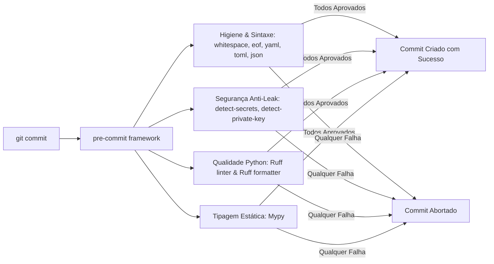

# Design: Esteira de Qualidade com Pre-commit Hooks

## Hook Pipeline Architecture

### Repositórios e Configuração
- `pre-commit/pre-commit-hooks` (v4.6.0)
- `astral-sh/ruff-pre-commit` (v0.6.9)
- `pre-commit/mirrors-mypy` (v1.11.2)
- `Yelp/detect-secrets` (v1.5.0)

### Exclusões de Escopo
Arquivos pesados gerados pelo Graphify (`graphify-out/`), worktrees temporárias (`.worktrees/`), backups e lockfiles determinísticos (`uv.lock`) não devem ser processados pelo `detect-secrets` para evitar falsos positivos com hashes SHA.
