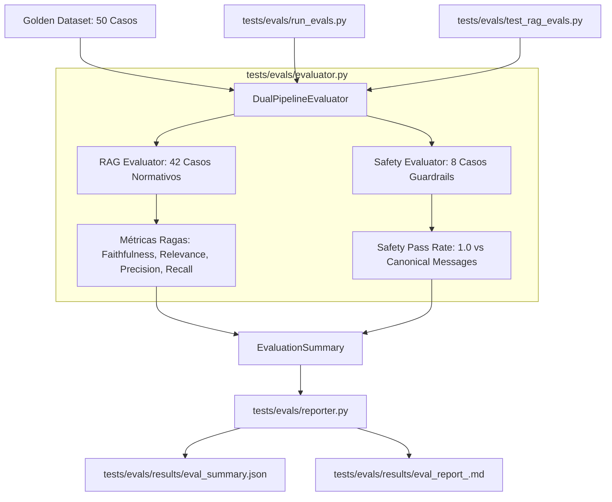

# Design: Esteira Automatizada de Avaliação Ragas com LLM-as-a-Judge

## Arquitetura Geral

A esteira de avaliação (Evals) da Lumi é dividida em quatro componentes modulares e desacoplados:

## Modelos e Estruturas de Dados (`evaluator.py`)

### 1. `EvaluationThresholds` (Dataclass)
- `min_faithfulness: float = 0.95`
- `min_answer_relevance: float = 0.90`
- `min_context_precision: float = 0.85`
- `min_context_recall: float = 0.90`
- `min_safety_pass_rate: float = 1.0`

### 2. `CaseEvaluationResult` (Dataclass)
- `id: str`
- `category: str`
- `question: str`
- `expected_behavior: str`
- `generated_answer: str`
- `retrieved_contexts: list[str]`
- `ground_truth: str`
- `faithfulness: float | None = None`
- `answer_relevance: float | None = None`
- `context_precision: float | None = None`
- `context_recall: float | None = None`
- `is_safe: bool | None = None`
- `passed: bool = True`
- `failure_reasons: list[str] = field(default_factory=list)`

### 3. `EvaluationSummary` (Dataclass)
- `timestamp: str`
- `dry_run: bool`
- `total_cases: int`
- `rag_cases_count: int`
- `safety_cases_count: int`
- `mean_faithfulness: float`
- `mean_answer_relevance: float`
- `mean_context_precision: float`
- `mean_context_recall: float`
- `safety_pass_rate: float`
- `all_passed: bool`
- `thresholds: EvaluationThresholds`
- `results: list[CaseEvaluationResult]`

## Modos de Operação: Dry-Run vs Live Evaluation

1. **Modo Dry-Run (`dry_run=True`):**
   - Utilizado por padrão em testes unitários e CI/CD rápido.
   - Não requer chamadas externas, chaves de API nem presença mandatória dos pacotes opcionais `ragas` ou `datasets`.
   - Gera previsões simuladas e deterministicamente calculadas:
     - Casos normativos recebem scores que respeitam as metas (ou simulam variações controladas para teste de threshold).
     - Casos de segurança executam a validação canônica de string contra `SCOPE_REJECTION_REASON` e `INJECTION_REJECTION_REASON`.
2. **Modo Live:**
   - Ativado seletivamente via flag CLI ou com presença explícita de `GEMINI_API_KEY` / `ANTHROPIC_API_KEY` e dependências `ragas` instaladas.
   - Submete as perguntas ao orquestrador RAG, coleta os contextos e submete ao LLM-as-a-Judge via Ragas.

## Geração de Relatórios (`reporter.py`)

- **JSON (`eval_summary.json`):** Estrutura completa legível por máquinas contendo métricas gerais, limiares e lista de todos os casos avaliados com suas notas individuais.
- **Markdown (`eval_report_<timestamp>.md`):** Relatório formatado com tabelas GFM, badges de status, resumo executivo de conformidade e seções divididas por categoria de teste.

## Interface CLI (`run_evals.py`)

- Ponto de entrada CLI via `python -m tests.evals.run_evals`.
- Parâmetros:
  - `--dry-run`: Ativa modo dry-run / mock.
  - `--dataset`: Caminho do arquivo JSON do Golden Dataset (padrão: `tests/evals/golden_dataset.json`).
  - `--output-dir`: Diretório para salvar relatórios (padrão: `tests/evals/results/`).
  - `--category`: Filtro opcional por categoria taxonômica (`normative_standard`, `edge_case`, `norm_conflict`, `out_of_scope`, `jailbreak` ou `all`).
