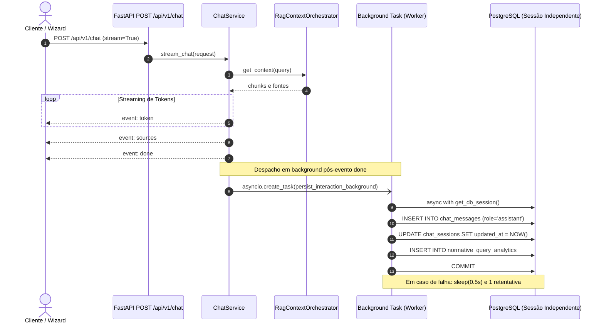

# Design: Persistência Desacoplada Assíncrona de Mensagens e Telemetria Analítica

## Architectural Decisions

### 1. Desacoplamento da Persistência e Latência de Entrega (ADR-04)
- No modo streaming (`stream_chat`), a persistência da resposta do assistente não deve retardar o envio de tokens ou o evento `done`. A rotina `persist_interaction_background` é despachada via `asyncio.create_task` imediatamente após `yield done`.
- No modo síncrono (`process_chat`), a persistência da resposta e analytics é delegada a `FastAPI BackgroundTasks` através do parâmetro `background_tasks`. Caso invocado fora do contexto de rotas FastAPI (ex.: scripts ou testes), executa fallback assíncrono transparente via `asyncio.create_task`.

### 2. Sessão de Banco Independente via `get_db_session()`
- Conexões de banco do FastAPI associadas ao request HTTP são fechadas automaticamente ao término do request.
- A função de background `persist_interaction_background` não reutiliza a sessão da rota HTTP. Em vez disso, utiliza o context manager assíncrono `get_db_session()`, garantindo isolamento transacional, commit e rollback determinísticos.

### 3. Resiliência com Retentativa e Backoff
- Falhas transitórias no banco de dados (timeout, concorrência ou reconexão) são tratadas com 1 retentativa automática após backoff de 500ms (`asyncio.sleep(0.5)`).
- Se a segunda tentativa falhar, o erro é registrado no `structlog` (`logger.error("persist_interaction_background_failed", ...)`), sem lançar exceções não tratadas para o usuário final.

### 4. Modelo e Métricas de Telemetria
- `NormativeQueryAnalytics`:
  - `session_id`: UUID da sessão conversacional vinculada.
  - `query_text`: Pergunta original sanitizada do projetista.
  - `top_document_code`: Código da norma mais relevante (ex.: "DIS-NOR-030"), ou `None` em recusas/contingências.
  - `top_similarity_score`: Maior score de similaridade retornado pelo retriever/reranker, ou `None` se ausente.
  - `latency_ms`: Duração total da execução (em milissegundos) medida desde a recepção até a conclusão da geração ou recusa.
  - `created_at`: Timestamp UTC atual.

## Sequence Diagram

