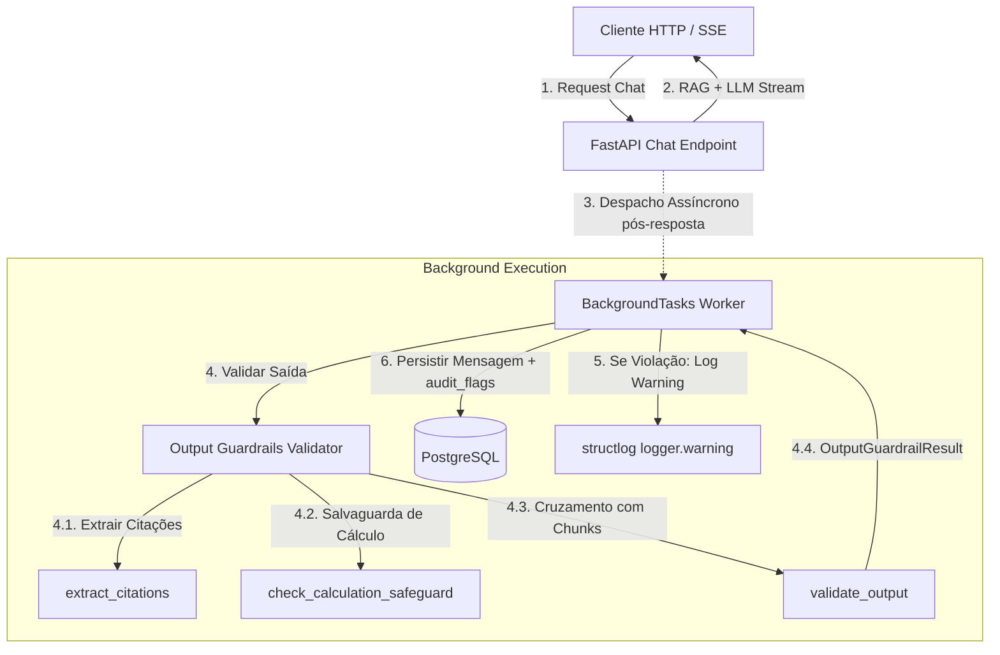

# Design: Validador Assíncrono de Citações e Guardrails de Saída via BackgroundTasks

## 1. Visão Geral da Arquitetura

Os Guardrails de Saída (Output Guardrails) representam a terceira barreira da arquitetura de IA Segura da Lumi (`src/lumi/rag/output_guardrails.py`). Operam em conjunto com o worker assíncrono `persist_interaction_background` em `src/lumi/services/analytics_service.py`.

A premissa central é **execução assíncrona não-bloqueante (ADR-04)** com auditoria puramente determinística:
- Não adiciona latência à transmissão token a token em SSE nem à rota HTTP síncrona;
- Extrai e cruza citações normativas diretamente com os metadados dos chunks (`RetrievedChunk`);
- Inspeciona conclusões numéricas de cálculo para assegurar conformidade com a regra de negócio RN-03 (direcionamento ao Wizard NeoGuide);
- Emite logs estruturados (`logger.warning("output_guardrail_violation", ...)`) e persiste flags de auditoria (`audit_flags`).



## 2. Estrutura de Dados: `OutputGuardrailResult`

Definida como dataclass imutável (`frozen=True`) para garantir integridade estrutural:

```python
from dataclasses import dataclass, field


@dataclass(frozen=True)
class OutputGuardrailResult:
    """Resultado estruturado da validação de guardrails de saída."""

    is_valid: bool
    valid_citations: list[str] = field(default_factory=list)
    hallucinated_citations: list[str] = field(default_factory=list)
    has_calculation_violation: bool = False
    warning_flags: list[str] = field(default_factory=list)
```

## 3. Especificação dos Componentes

### 3.1. Extração Determinística de Citações (`extract_citations`)
Expressão regular compilada para extrair referências formais e informais no texto da LLM:
```python
RE_CITATION = re.compile(
    r"(?:\[|\()?\s*(?:Fonte|Fontes)\s*:\s*([A-Za-z0-9_-]+)(?:\s*,\s*([^\]\)\n]+?))?\s*(?:\]|\))",
    re.IGNORECASE,
)
```
- Higieniza sufixos de paginação (ex.: `, Pág. 14` -> remove mantendo a seção `Item 5.2`).
- Retorna lista de tuplas `(document_code, section_code)`.

### 3.2. Salvaguarda de Responsabilidade de Cálculo (`check_calculation_safeguard`)
Conforme a RN-03 e o prompt do sistema (`LUMI_SYSTEM_PROMPT`), a LLM não deve emitir valores finais numéricos de demanda sem orientar o projetista a utilizar os formulários dedicados do Wizard NeoGuide.
- Analisa se o texto afirma valores numéricos de demanda/dimensionamento (ex.: `demanda total é de ... kVA`, `exatos ... kVA`, `cálculo resulta em ... kW`, `dimensionamento é de ... A`).
- Avalia a presença de menções ao `Wizard` ou `NeoGuide`.
- Se houver cálculo numérico absoluto sem menção ao Wizard NeoGuide, retorna `True` (violação detectada). Caso contrário, retorna `False`.

### 3.3. Cruzamento com Fragmentos do RAG (`validate_output`)
- Normaliza códigos de documento (ex.: `DIS-NOR-030`) e seções normativas (ex.: `"Item 5.3"` e `"5.3"` normalizam para equivalência).
- Classifica cada citação como válida ou alucinada com base nos chunks fornecidos no contexto.
- Constrói flags de aviso:
  - `"HALLUCINATED_CITATION"` se houver citações inexistentes no contexto recuperado.
  - `"CALCULATION_WITHOUT_WIZARD"` se houver violação da RN-03.
- Determina `is_valid = (not hallucinated_citations) and (not has_calculation_violation)`.

### 3.4. Integração no Worker `persist_interaction_background`
- Invocado assincronamente recebendo a resposta gerada e os fragmentos/fontes recuperados.
- Emite `logger.warning("output_guardrail_violation", ...)` com detalhes se `is_valid` for `False`.
- Anexa `audit_flags` nos dicionários de fontes da mensagem persistida no banco relacional.
