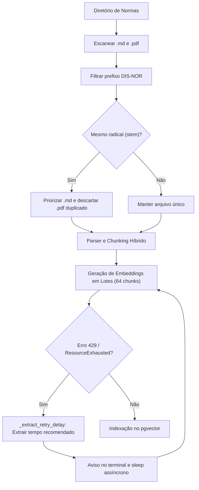
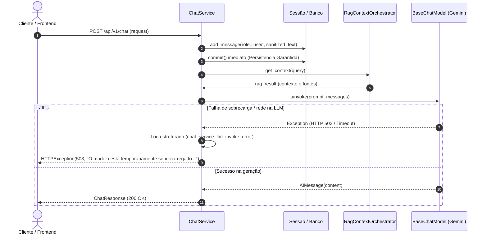

# Design: Ajustes Defensivos na Ingestão, Resiliência do Chat Service e Documentação Operacional Local

## Arquitetura & Fluxo de Dados

### 1. Ingestão Resiliente e Desduplicação Normativa

### 2. Resiliência Conversacional e Tolerância a Falhas no Chat

## Decisões Técnicas

1. **Backoff Dinâmico Adaptativo (`_extract_retry_delay`)**:
   - A API do Google pode retornar mensagens como `"Please retry after 23.4s"`. Extrair esse valor via regex permite respeitar exatamente a janela de retenção do provedor, evitando loops excessivos de retentativas prematuras.
2. **Priorização de Markdown sobre PDF na Ingestão**:
   - Quando tanto a norma formatada em Markdown quanto o PDF original coexistem na pasta de ingestão, o Markdown preserva fidelidade semântica de tabelas e cabeçalhos já higienizados, economizando tokens e evitando poluição da base vetorial com fragmentos duplicados.
3. **Commit Antecipado no ChatService**:
   - Manter a mensagem do usuário salva mesmo que o LLM falhe permite que a interface mostre o histórico real do que o usuário enviou, facilitando o reenvio subsequente sem perda de contexto conversacional.
4. **Tratamento Específico com HTTP 503**:
   - Ao traduzir falhas transitórias do LLM para HTTP 503 Service Unavailable, a API sinaliza explicitamente aos clientes HTTP (e proxies) que o serviço está momentaneamente indisponível e deve ser tentado novamente com backoff.
