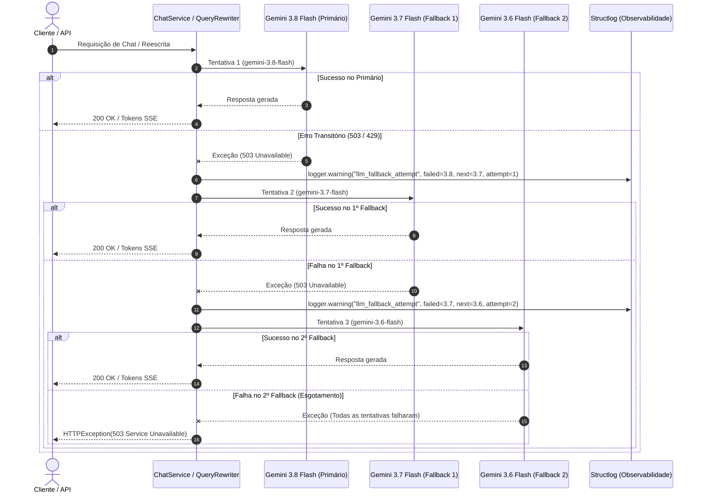

# Design: Cadeia de Fallback Automático de Modelos Generativos Gemini

## Architecture Overview
O mecanismo de fallback automático atua nas camadas de geração de linguagem natural e reescrita de consultas do Lumi NeoGuide. Quando uma requisição interage com o Google Gemini, o sistema instancia uma cadeia ordenada de modelos (`gemini-3.8-flash` -> `gemini-3.7-flash` -> `gemini-3.6-flash`). Em caso de erro transitório em qualquer tentativa (ex.: HTTP 503 Overloaded, HTTP 429 Quota Exceeded, ConnectionError), o orquestrador intercepta a exceção, registra telemetria estruturada e transfere a execução para o próximo modelo da cadeia.

## Component Breakdown

### 1. `src/lumi/core/config.py`
- Atualização do valor default do modelo primário Gemini para `gemini-3.8-flash`.
- Adição do atributo `gemini_fallback_models: list[str] = Field(default=["gemini-3.7-flash", "gemini-3.6-flash"])`.

### 2. `src/lumi/rag/llm_factory.py`
- Definição de constantes de resiliência:
  - `DEFAULT_GEMINI_PRIMARY_MODEL = "gemini-3.8-flash"`
  - `DEFAULT_GEMINI_FALLBACK_MODELS = ("gemini-3.7-flash", "gemini-3.6-flash")`
  - `MAX_FALLBACK_ATTEMPTS = 3`
- Utilitário `get_model_name(model: Any) -> str` para extração uniforme do nome do modelo (seja instância real ou mock).
- Função `get_llm_chain(provider: str | None = None, settings: Settings | None = None, **kwargs: Any) -> list[BaseChatModel]` retornando a lista ordenada com até 3 modelos.

### 3. `src/lumi/services/chat_service.py`
- Injeção de dependência opcional `fallback_llms: list[BaseChatModel] | None` no construtor.
- Propriedade `models: list[BaseChatModel]` que resolve a cadeia completa de execução.
- Em `process_chat`: loop iterativo com controle de tentativas (`attempt = 1..3`). Em falha, log estruturado e transição para o próximo modelo. Ao atingir o limite de 3 falhas, levanta `HTTPException(status_code=503)`.
- Em `stream_chat`: loop iterativo semelhante. Se a falha ocorrer antes de qualquer token ser enviado ao cliente SSE (`tokens_yielded == 0`), ativa o fallback e prossegue com o próximo modelo. Se a falha ocorrer durante o streaming ativo, emite evento SSE de erro. Caso todas as 3 tentativas falhem antes do início da transmissão, propaga `HTTPException(status_code=503)`.

### 4. `src/lumi/rag/rewriter.py`
- Suporte a `fallback_llms` e resolução de `self.models`.
- Laço de tentativas com emissão de warning estruturado para cada transição. Caso todas as tentativas da cadeia falhem, mantém degradação graciosa retornando a pergunta original limpa.

## Trade-offs & Design Decisions
1. **Transmissão SSE e Idempotência de Stream:** Se um modelo já tiver gerado e transmitido tokens ao cliente via SSE, reiniciar o stream em outro modelo produziria respostas duplicadas ou truncadas para a interface. Portanto, o fallback de modelo em streaming é ativado quando a falha é detectada antes da emissão de tokens.
2. **Capacidade Máxima Estrita:** O teto de 3 tentativas sequenciais impede deadlocks ou latências acumuladas desproporcionais perante o usuário.
